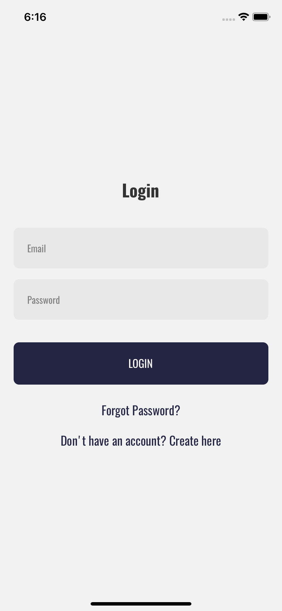
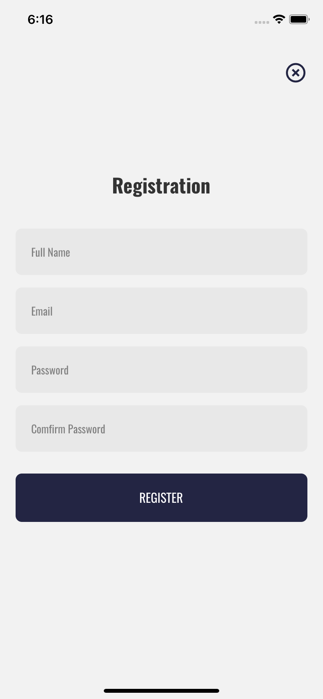
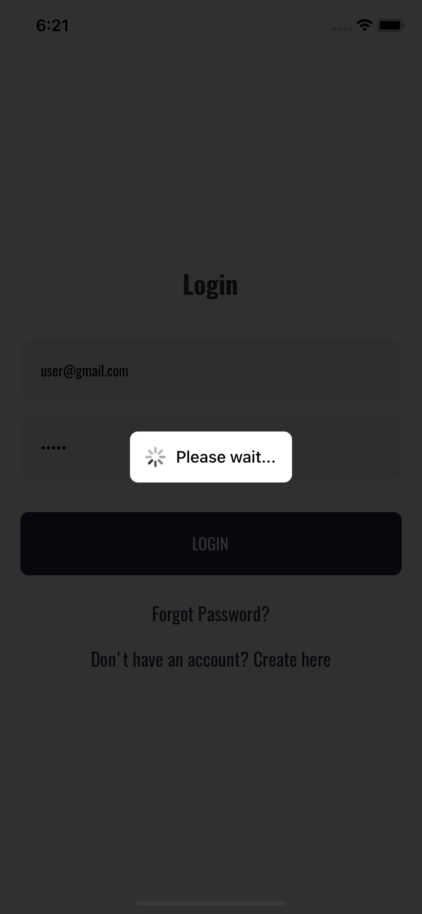

# React Native Login and Registration Screen.
<table>
  <tr>
    <td></td>
    <td></td>
  <tr>
  <tr>
     <td></td>
    <td></td>
  <tr>
  <tr>
    <td></td>
    <td></td>
  <tr>
</table>

## How to use
- `git clone https://github.com/daniyelgamit/ReactNativeLoginScreen.git`
- `cd ReactNativeLoginScreen`
- `yarn install`
- `cd ios`
- `pod install` 
- `cd ..`
- `react-native run-ios` or `react-native run-android`
